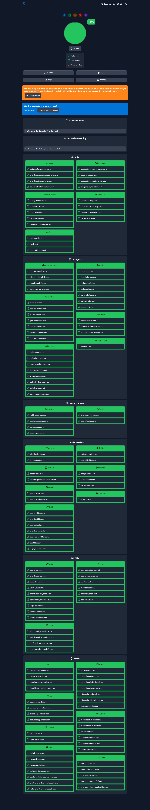

<p align="center">
    
</p>

# OrbitBlocker

OrbitBlocker is a Manifest V3 extension for Chromium browsers that aggressively suppresses ads, sponsored content, tracking scripts, and OEM telemetry endpoints while keeping the UI simple for daily use.

<p align="left">
    
    
    
    
</p>

## Version Snapshot

| Item | Value |
| --- | --- |
| Current extension version | **1.1.3** |
| Last docs refresh | **2026-04-10** |
| Rules architecture | Static DNR + Dynamic adaptive learning |
| Browser target | Chrome, Edge, and MV3-compatible Chromium browsers |

## Latest Blocking Result

The image below is the latest real test snapshot requested in this update.



- Score: **100%**
- Total checks: **133**
- Blocked: **133**
- Not blocked: **0**

## Core Capabilities

- YouTube ad cleanup including sponsored shelves, player overlays, and My Ad Center surfaces.
- Facebook sponsored-content suppression with DOM heuristics and tracking endpoint blocking.
- Global ad and tracker protection with EasyList, EasyPrivacy, AdGuard Base, and custom hard-shield rules.
- OEM/mobile telemetry blocking for Xiaomi, Realme, Oppo, Vivo, Samsung, Huawei, Lenovo, Microsoft, and Apple analytics hosts.
- Redirect-popup and clicktrap protection.
- Manual right-click blocking for host and element-level controls.
- Adaptive auto-learning engine with diagnostics and visibility in extension tools.

## Enabled Rulesets (Default)

| Ruleset | Purpose |
| --- | --- |
| `youtube_core` | YouTube-specific ad and telemetry requests |
| `facebook_tracking_shield` | Facebook sponsored and tracking endpoints |
| `easyprivacy_global` | Broad tracker suppression |
| `easylist_global_ads` | Global ad network filtering |
| `adguard_base_ads` | Additional ad network and script coverage |
| `provider_hard_shield` | Explicit provider-level hard blocking |
| `oem_google_tracking_shield` | OEM + analytics/telemetry endpoint blocking |
| `popup_redirect_shield` | Redirect and clicktrap popup suppression |

## Installation

### Install from GitHub Release

1. Open the repository Releases page.
2. Download the asset matching your browser.
3. Prefer CRX builds:
    - `OrbitBlocker-vX.Y.Z-chrome.crx`
    - `OrbitBlocker-vX.Y.Z-edge.crx`
    - `OrbitBlocker-vX.Y.Z-chromium.crx`
4. If CRX install is blocked by policy, use ZIP and load unpacked.

### Install from Source

1. Clone this repository.
2. Build assets and rules (optional if already committed):

```bash
npm run build:icons
npm run build:rules
```

3. Open browser extensions page.
4. Enable Developer mode.
5. Choose Load unpacked and select this project folder.

## Development Commands

```bash
npm run build:icons
npm run build:rules
npm run build:release
```

Release packaging script: `scripts/package-release.ps1`.

## Documentation

- Contribution guide: [CONTRIBUTING.md](CONTRIBUTING.md)
- Security policy: [SECURITY.md](SECURITY.md)
- Code of conduct: [CODE_OF_CONDUCT.md](CODE_OF_CONDUCT.md)
- Release notes: [RELEASE_NOTES_v1.1.3.md](RELEASE_NOTES_v1.1.3.md)

## Project Boundary

This project focuses on ad, sponsored-content, and tracking suppression. It does not implement bypass logic for platform access-control enforcement.

## License

Licensed under the ZN Blocker Community Non-Commercial License v1.0.

- Non-commercial use is allowed.
- Commercial resale, paid redistribution, SaaS monetization, and white-label resale are prohibited.

Read full terms in [LICENSE](LICENSE).